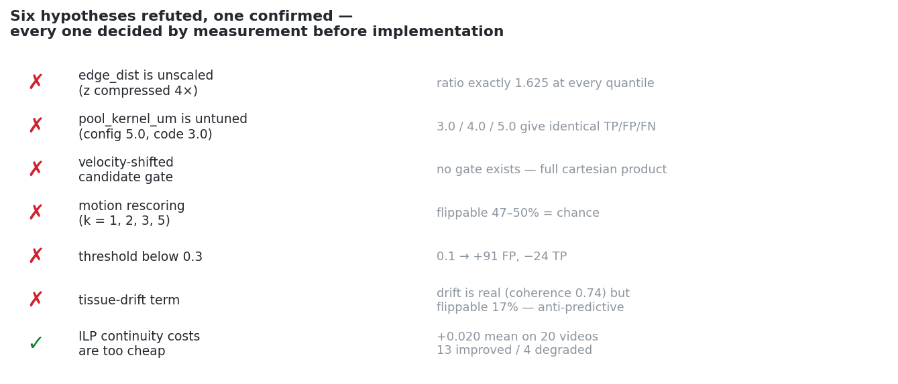
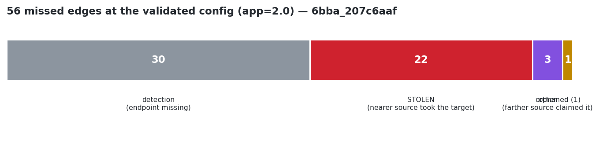
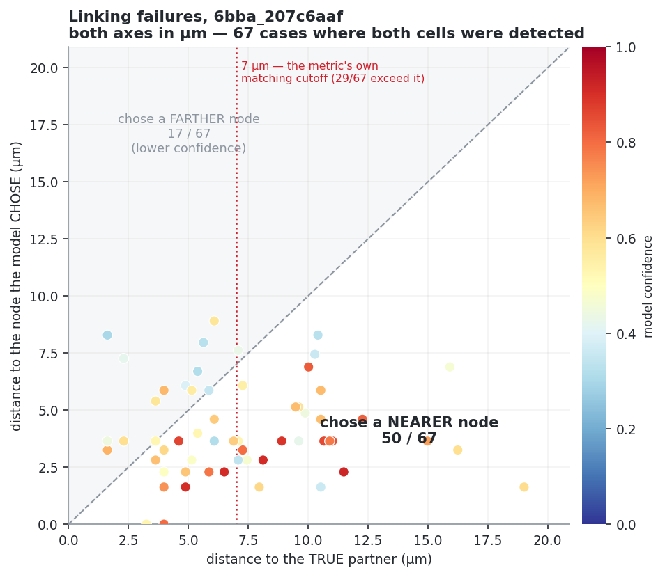
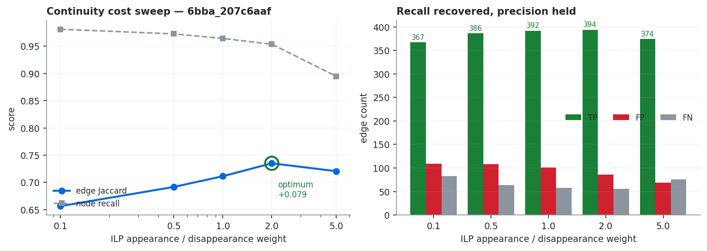
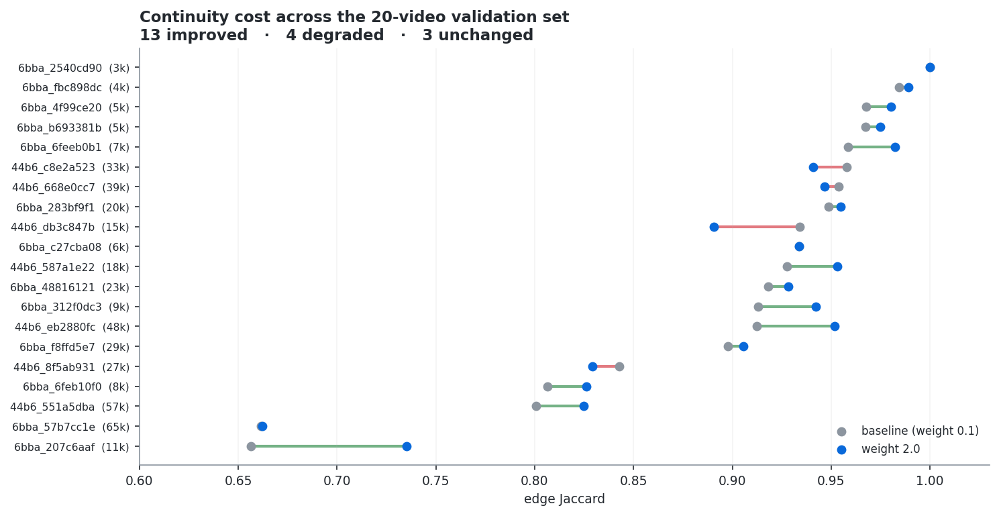

# Cell Tracking During Development — A Diagnostic Rebuild

> Reverse-engineering a 3D+time cell-tracking pipeline to find out **why** it
> fails, rather than tuning it until it stops.


-0.890-1a7f37)


---

## TL;DR

The baseline is **not detection-limited**. It finds 99% of annotated nuclei and
then wires them together wrongly.

Reading the code rather than sweeping it turned up two structural findings:

1. A `softmax(dim=0)` over candidate parents, combined with a 0.5 threshold,
   makes in-degree ≥ 2 **arithmetically impossible**. The ILP downstream had no
   alternatives to arbitrate — it was acting as a filter, not a solver.
2. The ILP's continuity costs sit at **0.1**, effectively free, so the solver
   had no reason to prefer an unbroken track over breaking it and starting
   another. This is the largest lever in the pipeline and it had never been
   swept, because the threshold above made it inert.

Acting on both: **0.866 → 0.884**, validated on 20 videos first.

Five further hypotheses were tested and refuted — each decided by measurement
before any implementation. The refutations are the more useful half of this
document.



---

## The problem

```
  100 frames  ×  64 × 256 × 256 voxels  ×  uint16
  ┌─────────────────────────────────────────────────┐
  │  t=0        t=1        t=2       ...    t=99    │
  │   ●  ●       ●  ●       ●   ●            ●  ●   │
  │  ●    ●  →  ●    ●  →  ●     ●   →  ...  ●   ●  │
  │    ●  ●       ● ●        ●  ●             ● ●   │
  └─────────────────────────────────────────────────┘
       detect ──────► link ──────► lineage graph

  voxels are ANISOTROPIC:  z = 1.625 µm,  y = x = 0.40625 µm   (4:1)
  labels are SPARSE:       ~2–5% of cells annotated per video
```

`score = adjusted_edge_jaccard + 0.1 × division_jaccard`. Predictions are
matched to ground truth by bipartite assignment on scaled centroid distance,
max 7 µm.

199 labelled training videos. Estimated node counts span **3,783 → 78,644** —
a 21× range, standard deviation 82% of the mean. Only two stem prefixes
(`6bba`: 128, `44b6`: 71), almost certainly two embryos.

---

## Pipeline as built

```
   raw zarr
      │
      ▼
 ┌──────────────┐
 │TemporalUNet3D│  window_size=2, downsample=[1,4,4]
 │   detector   │  ── anisotropy handled here: y/x ÷4 makes the
 └──────────────┘     data isotropic before convolution
      │
      ▼  local-max peaks, NMS radius pool_kernel_um
 ┌──────────────┐
 │  transformer │  scores the FULL source × target product
 │  edge scorer │  → edge_prob      (no spatial gate exists)
 └──────────────┘
      │
      ▼  softmax(dim=0), threshold, greedy arity-limited assignment
 ┌──────────────┐
 │  ILP  solver │  appearance / disappearance cost
 └──────────────┘
      │
      ▼   .geff lineage graph
```

---

## Findings

### 1. Detection is solved; linking is not

Across the 20-video validation set, **mean node recall 0.9927** (min 0.948).
A perfect detector would recover at most ~3.5% of edge mass on a typical video
— each missed node destroys at most two edges. The observed loss was 9–13%.

**Replacing the detector cannot reach most of the gap.**

### 2. Greedy assignment was discarding usable scores

One flag. Same weights, same scores, same detections:

```
                greedy     ILP       Δ
 6bba_0c7fa718   0.898  →  0.917   +0.019
 44b6_d78e09d9   0.816  →  0.874   +0.058
 division FPs    36     →  0
```

The transformer's output was fine. The thing consuming it was not.

### 3. The softmax caps in-degree at 1 — by arithmetic

```python
probs = torch.softmax(raw, dim=0)     # raw is (n_src, n_tgt)
...
if probs[i, j] > cfg.threshold        # 0.5
```

`dim=0` normalises across **sources**, so for any target the probabilities sum
to 1. At a 0.5 threshold, **at most one source can ever clear it**.
`max_parents_per_node` never binds; the constraint is mathematical, not
configured.

Two consequences:

- The ILP receives exactly one candidate parent per node. It can keep or
  delete, never re-parent. **That is the opposite of what a solver is for.**
- A target whose softmax is *diffuse* — 0.45 / 0.35 / 0.20 across three
  plausible parents — clears nothing and gets no parent at all. Uncertainty
  produces silence rather than a best guess.

Lowering the threshold to 0.3 moved the score by nothing on its own (TP +5,
FP +6). Its value was making §5 possible. 0.3 is optimal: 0.5 collapses
in-degree, and 0.2 and 0.1 are both worse ([§7](#7-five-negative-results)).

### 4. Three distinct failure mechanisms



Every missed edge on `6bba_207c6aaf` was traced to what the model did instead.

**STOLEN (43/83).** The true target was claimed by a *different, nearer*
source. The geometry is stark — in the largest subgroup, median distance from
the true parent is **9.61 µm** against the claimant's **3.98 µm**. Notably the
claimant often wins with a *lower* probability than the true parent achieved
elsewhere: the greedy loop processes candidates in global probability order, so
whoever arrives first takes the target.

**ORPHANED (18/83).** Nothing claimed the true target at all. The true source
still had a free child slot. The only way this happens is the true edge scoring
below threshold on its own merits — a pure scoring failure with no competition
involved.

**Detection (14/83)** and **other (8/83)**, the latter being targets claimed by
a source *farther* away than the true parent, which distance does not explain.

The overall distance signature:



| | |
|---|---|
| chose a **nearer** node | 50 / 67 |
| chose a farther node | 17 / 67 (lower confidence) |
| median true distance | 6.08 µm |
| median chosen distance | 3.64 µm |
| true partner beyond the 7 µm matching cutoff | 13 / 67 |

That last row rules something out: for 81% of failures the true edge was well
within range. **This is a scoring and competition failure, not a
candidate-generation failure** — which is what made the gate experiments in §7
worth running, and what made them fail.

And the scorer is *not* distance-blind. Its true positives track the GT
displacement distribution almost exactly (median 3.25 vs 2.96 µm, p90 6.08 vs
6.09), with 66 correct links beyond 5 µm and 20 beyond 7 µm, out to 9.61 µm.
`corr(edge_prob, edge_dist) = −0.379` — a real but moderate preference, not a
range limit. The model *can* select distant partners; it mis-breaks ties when a
closer plausible decoy exists.

### 5. ILP continuity costs — the main result

`--ilp-appearance-weight` and `--ilp-disappearance-weight` both default to
**0.1**. Starting and ending tracks is nearly free.



```
 weight    TP    FP    FN   node recall   edge Jaccard
   0.1    367   109    83      0.981         0.657
   0.5    386   108    64      0.973         0.692
   1.0    392   101    58      0.964         0.711
   2.0    394    86    56      0.954       * 0.735
   5.0    374    69    76      0.895         0.721
```

Recall is recovered **without paying in precision** — FP falls alongside FN.
Past 2.0 the mechanism reverses: the solver excludes real cells it cannot fit
into a continuous track, and node recall collapses.

### 6. Validated across 20 videos



| | baseline | weight 2.0 | Δ |
|---|---|---|---|
| mean adj. edge Jaccard | 0.8908 | **0.9106** | +0.0198 |
| micro edge Jaccard | 0.8791 | **0.8902** | +0.0111 |
| TP / FP / FN | 13097 / 959 / 842 | 13257 / **953** / **682** | +160 / −6 / −160 |
| mean node recall | 0.9927 | 0.9852 | −0.0075 |

**13 improved, 4 degraded, 3 unchanged.** 160 true links recovered while false
positives went *down*.

All four regressions are `44b6`; 12 of 13 `6bba` videos improved. If the two
prefixes are two embryos, a continuity prior tuned on one may not transfer
cleanly to the other — untested, but the pattern is consistent.

**Leaderboard: 0.866 → 0.884.**

### 7. Five negative results

Each was decided by a measurement that cost hours, before any implementation
that would have cost days.

<details>
<summary><b>1 · The anisotropy hypothesis — refuted</b></summary>

`edge_dist` looked like it might be computed in raw voxels, compressing z by 4×
and biasing the model toward lateral neighbours. Tested by recomputing every
distance two ways:

```
  ratio (µm / stored) across 300 sampled edges
  min 1.625 │ 25% 1.625 │ 50% 1.625 │ 75% 1.625 │ max 1.625
```

Exactly constant. Distances are **isotropic**, in downsampled units where
1 unit = 1.625 µm. The distance preference is a genuine modelling behaviour,
not an implementation error.
</details>

<details>
<summary><b>2 · <code>pool_kernel_um</code> — a dead parameter</b></summary>

The detection NMS radius is read from the weights' `config.json` (5.0) by
`load_model`, never returned, and silently replaced by `PredictConfig`'s
hardcoded **3.0**. No CLI flag existed, so no environment-variable sweep could
reach it — which made it look like untouched ground.

Exposed it and swept on top of the weight-2.0 config:

```
  pool 3.0   TP 394  FP 86  FN 56      ← baseline
  pool 4.0   TP 394  FP 86  FN 56      identical
  pool 5.0   TP 394  FP 86  FN 56      identical
  pool 6.0   TP 382  FP 84  FN 68      worse
```

Byte-identical through 5.0. The config/code discrepancy was never costing
anything.
</details>

<details>
<summary><b>3 · A velocity-shifted candidate gate — refuted twice</b></summary>

If cells move smoothly, searching around the *predicted* position —
`pos(t) + [pos(t) − pos(t−1)]` — would propose the true partner for fast-moving
cells at the same radius. Tested on ground truth:

```
                         residual < raw      gate 7 µm:  recovered   lost
  6bba_207c6aaf (0.735)     230/425  (54%)                    13      20
  44b6_d78e09d9 (0.877)     288/439  (66%)                     0       0
```

One-frame velocity is barely better than chance on the failing video. Longer
windows helped — k=1→k=2 jumps 54%→66%, then plateaus, a signature of voxel
quantisation noise rather than long-range persistence — and at k=3 the trade
turns positive (+16/−3).

Then reading `predict_video` closely killed it anyway: **there is no spatial
gate**. Candidates are the full cartesian product of source × target, filtered
only on probability. There was nothing to shift.
</details>

<details>
<summary><b>4 · Motion rescoring — refuted</b></summary>

If not a gate, then a bias on the logits: `raw_adj = raw + α·(−residual/σ)`,
re-softmaxed. This only helps if, for the failures, the true partner is closer
to the velocity-predicted position than the competitor the model chose.

```
   k    FLIPPABLE (true nearer than chosen, by motion residual)
   1    24/51  (47%)      median margin  −0.26
   2    25/50  (50%)      median margin  −0.01
   3    24/48  (50%)      median margin  −0.14
   5    22/45  (49%)      median margin  −0.33
```

Chance, at every window, with a slightly *negative* margin — the chosen
competitor is marginally more motion-consistent than the true partner. And this
is the ceiling: it uses ground-truth velocity, where the real pipeline would
use its own sometimes-wrong assignments.

Raw distance discriminates these pairs (71–73%). Motion does not (47–50%).
**The decoys are genuinely ambiguous** — equally consistent with where the cell
was heading.
</details>

<details>
<summary><b>5 · Lowering the threshold below 0.3 — refuted</b></summary>

The 18 orphaned targets in §4 must have scored below threshold, so lowering it
should admit them. And the regime had changed: the previous 0.5 → 0.3 test
predated the continuity costs, when the solver had no reason to reject spurious
links.

```
  threshold   ΔTP   ΔFP   mean Δ edge Jaccard
     0.2       −1   +31        −0.012
     0.1      −24   +91        −0.050
```

The extra candidates are almost entirely wrong, *and* they displace previously
correct assignments — TP falls. Those 18 true edges are not separable by
threshold: their scores are not ranked above the noise around them. A
calibration fix would not help; the ordering itself is wrong down there.

0.3 is now bracketed on both sides and confirmed optimal.
</details>

---

## Practical constraints

**The ILP is the bottleneck and does not scale gracefully.** Moving the UNet to
GPU cut inference to under a minute; SCIP still runs on CPU and now dominates.
At continuity weight 5.0 the solve went from 5 minutes to over two hours per
video — same graph, tighter constraints, exponentially larger search tree. On
16 GB RAM the largest validation video (65k estimated nodes) could not be
solved at all.

This caps the lever independently of score, and is the argument for Ultrack's
windowed formulation.

**Precision is not free.** A common reading of this metric is that unmatched
predictions carry no penalty. The reference implementation is narrower: an edge
from a *matched* node to an unmatched one counts as a full false positive. Only
edges between two entirely unmatched nodes are ignored.

---

## Validation methodology

- **20-video subset**, stratified by estimated node count, spanning
  3,783 → 65,511, prefix ratio 13:7 (population 128:71). Frozen before any
  experiment ran.
- Local micro-average tracked the leaderboard to **0.006** on the second
  submission (0.890 local → 0.884 public).
- A two-video validation set was **optimistic by ~0.03** and gave no visibility
  into the density range. Single-video results on this baseline should be read
  with that in mind.
- **MPS and CUDA agree to 16 significant digits.** Device is not a confound.

---

## Reproducibility notes

<details>
<summary><b>Offline Kaggle submission — dependency resolution</b></summary>

Code competitions run with internet disabled. Installing the project's wheel
set naively breaks the environment: replacing NumPy or SciPy causes
`ImportError: cannot import name '_center' from 'numpy._core.umath'`, because
Kaggle's preinstalled SciPy is compiled against its own NumPy.

```python
import subprocess, glob
wheels = [w for w in glob.glob(f"{WHEELS}/*.whl")
          if not any(k in w.lower() for k in ("numpy", "scipy"))]
subprocess.run(["pip", "install", "--no-index", "--no-deps",
                f"--find-links={WHEELS}"] + wheels, check=True)
```

Leave NumPy and SciPy alone. Everything else installs cleanly with `--no-deps`.
</details>

<details>
<summary><b>Guards worth having</b></summary>

Several path bugs produced *valid-looking output* rather than errors —
including scoring ground truth against itself, which returned a perfect 1.000
and an `adj_edge_jaccard` of 1.098.

```python
assert gt_path.exists()
assert pred_path.exists()
assert pred_path.stem == stem
assert "predictions" in str(pred_path)
assert row["adj_edge_jaccard"] <= 1.0   # see note
```

The last is a mathematical invariant and catches the most — but one video
legitimately exceeds 1.0, since the metric awards a bonus for predicting fewer
nodes than estimated. Treat it as a warning.

**A unit bug survived into an earlier draft of this document.** The failure
analysis compared `true_um` (micrometres) against `edge_dist` (downsampled
units, 1 unit = 1.625 µm), inflating "chose a nearer node" from 50 to 62 of 67
and the beyond-cutoff count from 13 to 29. Caught only when plotting both on
the same axes. **Charts are a correctness check, not just presentation.**
</details>

---

## Related work

**HOCT** (Bragantini, Theodoro & Royer, 2026) reaches a compatible conclusion
from the opposite direction: candidate-graph topology carries little usable
signal, because edges sharing a node have near-random label agreement
(adjusted homophily 0.01 ± 0.04 on the line graph). Their answer is an
edge-centric transformer where candidate links attend to one another under a 3D
geometric prior — including a line-to-line distance bias distinguishing two
links running parallel (coherent motion) from two that nearly intersect
(a collision).

Their softmax is the principled version of the bottleneck in §3: normalised per
target *and* per temporal gap, with a constant in the denominator acting as an
implicit "no parent" option, so a link need not exceed 0.5 to survive. The ILP
decides instead of the threshold.

The STOLEN mechanism in §4 is an independent measurement of why edge-relational
context should matter: candidate link A→B is scored with no knowledge that C→B
exists. The softmax is the only thing coupling them, and it couples them by
forcing competition rather than by letting them inform each other.

---

## Where this leaves the problem

The remaining 83 missed edges on the worst video are not one problem. Position
does not separate the decoys from the truth; trajectory does not either, at any
window. What is left:

- **Appearance.** `predict_edges` already receives 32-channel UNet features for
  both endpoints, so the information is present and evidently underweighted
  rather than absent. Measuring whether feature similarity separates true
  partners from decoys would say whether the ceiling is the representation or
  the data.
- **Edge-relational context** for the 43 STOLEN cases, which by construction
  cannot be fixed by scoring pairs independently.
- **The 8 "other" cases**, where a *farther* source claimed the target —
  unexplained by any geometric account.
- **Line-graph homophily** has not been measured on this dataset.

---

*Built as a learning exercise: every function typed and understood rather than
pasted. The diagnosis is the deliverable.*
